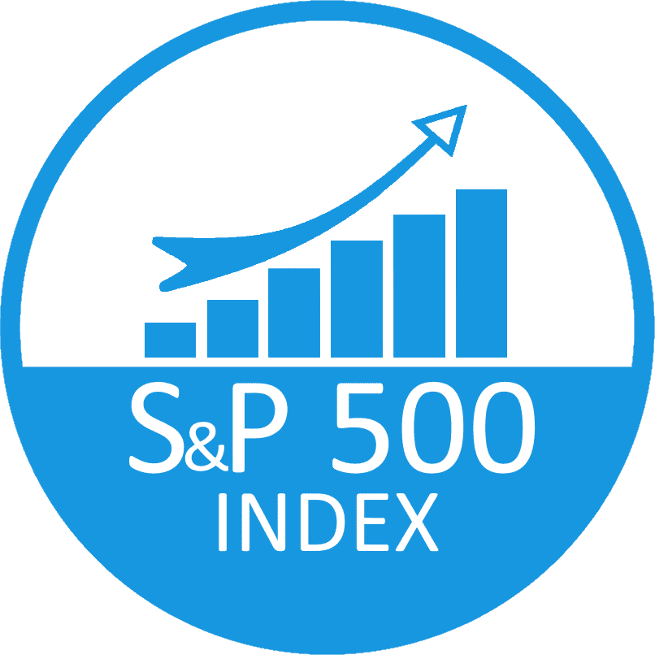
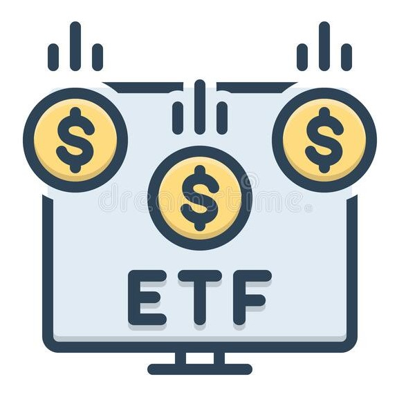

# **Investment Analysis**

_Engineer: Paulo C. Suclly A._

In this project We are going to analize the market and find the best opportunities of investment.

## **Content Of The Project**

The data that will be analized will be S&P 500, AI ETF's and Commodities.

The steps to complete this task will be:
* Download the historical data using the Library Yahoo Finance.
* Do the ETL part to check if the downloaded data is sorted and clear.
* Do the EDA part, there We will explore the data, understand it and find relations to get to conclutions.

## **Analysis Process**

After checking that all the data is sorted and filled. We started analizing the S&P 500 Index. Our Data range will be from 2000-01-01 to 2023-02-24.

 

We could see that the trend is still bullish. The increment of interest rates from FED are affecting the Index, but it's not enough to change the trend from bullish to bearish. We have to keep in mind that according to experts the increment is not over yet and the volatility will continue at least for this year.

 

We calculated the Cumulative Return, Volatility, Daily return and Average Yearly Return. From 2000-01-01 to 2023-02-24 the Cumulative Return was 172.81% also the Average Yearly Return was 6.08% those 2 KPI's are perfect to evaluate first the profitability of the index.

 

We found that one of the sectors of S%P 500 that has a decent increment was the Technological one. Nowadays the hype is related to AI Projects/Companies. We analized 2 ETF's related to AI. We see a huge potential on this sector, that's why We based part of analysis on this sector.

 

We can't forget that We are facing the possible start of an intercontinental armed conflict. A haven of value are commodities, to be more specific We are talking about Gold and Crude. When the conflict between Russia and Ukraine started, the price of Crude/Gas increased. That's why We found attractive to have a little percentage of our investments in commodities (Gold and Crude).

# **Conclusion**

To conclude with this invesment analysis. We advice to diversificate your investments and the proportion that We found optimal is 20% in S&P 500 Index, 30% in AI ETF's, 15% in Commodities and 35% keep it in cash to be ready to take advantage of any volatility caused by a possible war or the increment of interest rate (FED).

 

  

