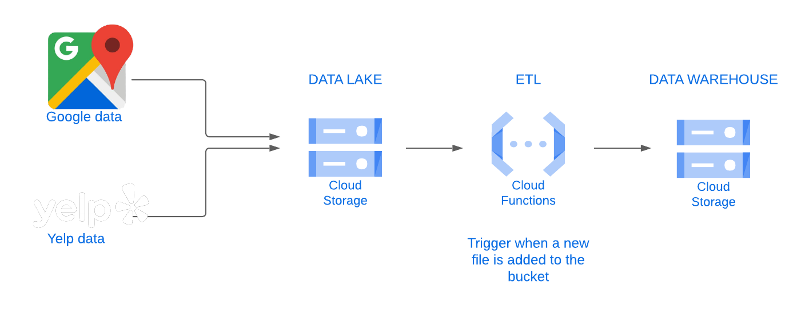

# **Data Processing**

One of the most important things on this project is the treatment and organization of the data. The following shows the data processing scheme. 

## Data Lake

One of the most important things on this project is to have our Data Lake. What is a Data Lake ?
A Data Lake is a data storage system that allows large amounts of data to be stored in its native format, without the need for prior structuring, allowing faster and more flexible access to data. There We are going to store the raw data of Google & Yelp.

